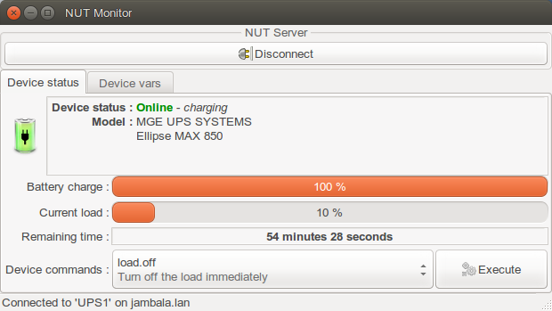
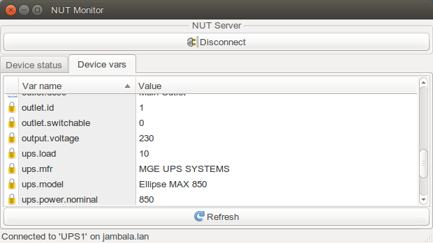
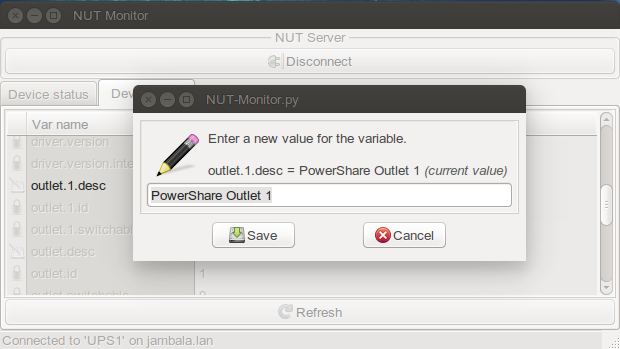

NUT-Monitor
===========

NUT-Monitor is a graphical application to access and manage UPSes connected to
a NUT (Network UPS Tools) server.

Dependencies
------------

This application (variants written in Python 2 + GTK2, and in Python 3 + Qt5)
uses the python-pynut class (available at http://www.lestat.st), delivered
as PyNUT in the NUT source tree.

Refer to your OS packaging and/or install custom modules with `pip` (or `pip3`)
to get required dependencies (GTK + GObject or Qt5).

Path to PyNUT module
--------------------

For quick tests (e.g. during development), you can run the clients like this:

----
:; PYTHONPATH=../module/ python2 ./NUT-Monitor-py2gtk2.in
----

or:

----
:; PYTHONPATH=../module/ python3 ./NUT-Monitor-py3qt5.in
----

Localization
------------

For localized UI, on some platforms you can also request the locale with different
precision like `export LANG=fr_FR.UTF-8`, `export LANG=it_IT` or `export LANG=ru`
(see and feel welcome to improve the choice of languages in `locale` directory);
however on some others you are required to use the `xx_YY.UTF-8` spec format.

NOTE: Currently, the localization only fully works for Python 2 client, while
menu names, dialog field labels, etc. remain in default English wording despite
the presence of translations in resource files. PRs to attach them to run-time
rendering in the Python 3 client are welcome.

Note that some items, like the standard menu items for Preferences or About,
can come from the interpreter's default library and so partially cover the
interface elements in other languages (e.g. system default) independently of
the resources provided with the script or its sources (at least in the
Python 2 / GTK2 variant of the UI).

Desktop menu integration
------------------------

This component ships both implementation-specific `nut-monitor-py2gtk2.desktop`
and `nut-monitor-py3qt5.desktop` files which allows a user to have icons for
both variants separately, as well as the legacy-named `nut-monitor.desktop`
for running the wrapper script `NUT-Monitor` which picks an implementation best
suited for current run-time circumstances.

Screenshots
-----------

Development/Testing notes
-------------------------

As Python2 falls out of favor and packaging scope of different distributions,
one where both variants of the script can be tested simultaneously as of 2025
is MSYS2 (on Windows), see linkdoc:qa-guide[Prerequisites for building NUT
on different OSes,NUT_Config_Prereqs,docs/config-prereqs.txt] for more
details about general prerequisites for the NUT build in that environment.

Regarding the Python UI support, you would need:

----
:; pacman -Sy mingw-w64-x86_64-python2-pygtk mingw-w64-x86_64-python-pyqt5
----

This should pull in the interpreters and libraries involved.

You may have to add this to your `~/.bashrc` for Python 2 to work properly:

----
PYTHONIOENCODING=UTF-8
export PYTHONIOENCODING
----

To iterate during specifically localization development, you can edit the `.in`
template sources of the scripts and the localization files, and (from the `app`
directory) run with:

----
:; (cd .. && make `pwd`/app/locale/*/*/*) ; (cd ../../../ && ./config.status \
   scripts/python/app/NUT-Monitor-py2gtk2 scripts/python/app/NUT-Monitor-py3qt5) \
   && LANG=fr_FR ./NUT-Monitor-py2gtk2
----

or `..../NUT-Monitor-py3qt5` respectively.

NOTE: While `LANG=it` can be useful on MSYS2 for testing that localization does
take place, it proved problematic to load `fr` and `ru` resources -- logic
buried inside `gtk.glade.XML()` and `gtk.glade.xml_new_from_buffer()` gets
the UTF-8 encoded data from `ui/gui-1.3.glade`, but then apparently mangles
it inside (possibly in the DLL used by the Python module) to some other
encoding, and then fails to parse that as UTF-8 (broken non-ASCII characters
in `fr`, crash in `ru`). PRs with fixes would be welcome!

Kudos
-----

NUT-Monitor and PyNUT (for Python 2 syntax) were originally authored
by David Goncalves <david@lestat.st>

NUT-Monitor was converted to Python 3 + Qt5 by Luke Dashjr

PyNUT was extended, and two variants of NUT-Monitor converged and wrapped
for Python 2+3 dual support by Jim Klimov
